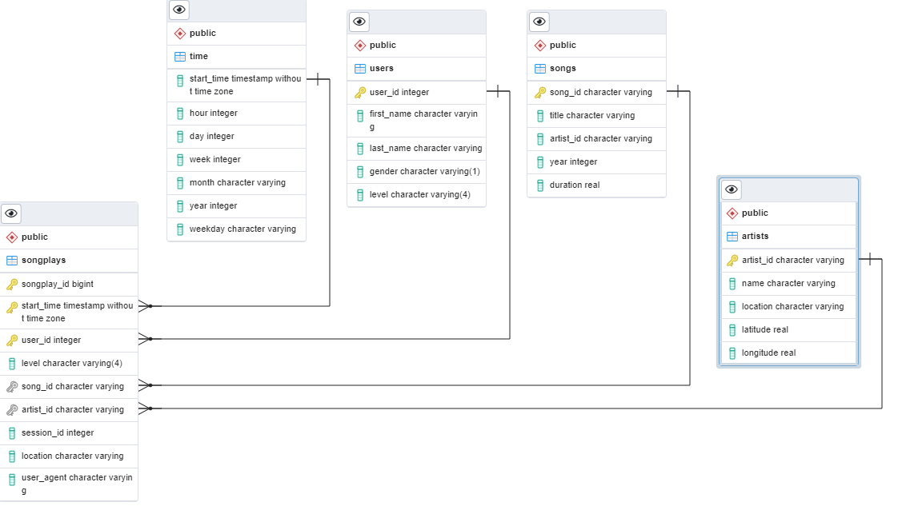

# Sparkify Song Play Data Warehouse on AWS RedShift Project

### ***Udacity Data Engineering Course 2: Cloud Data Warehouses***
### ***Final Course Project Assignment***

***
A music streaming startup (Sparkify) stores all it's key event data on S3.

This project implements a RedShift data warehouse to consume this data from S3, 
load the data to redshift staging tables then transform the staged data
and load it into the analytical tables and this point any analysis can easily
be carried out.

The whole project is based on mainly AWS Boto3 Python SDK and psycopg2 PostgreSQL library.
***
## Contents: 
1. Data to be used: the data is stored in a S3 Bucket
    1. Listening events for it's streaming data as JSON logfiles.
    2. Song data for all tracks available on it's service as JSON files. 
    
2. Python Scripts in Folder root and order of execution
    1. **create_redshift_cluster_test_connection.py** - provisions a redshift Cluster, associates appropriate IAM roles with the Cluster, allows TCP connections and tests a connection to the Cluster using dwh.cfg parameters. 
    After running update the Endpoint in dwh.cfg for all files to use.

    2. **sql_queries.py** - RedShift Queries to Create/Delete Database tables, load S3 data to staging tables, and insert staged data into final destination tables. 
    The distribution of data in the cluster is also specified here with the distkey and sortkey for applicable tables.

    3. **create_tables.py** - imports queries, deletes  then creates all tables.

    4. **etl.py** - loads data into staging tables from S3 then transforms and loads that data into the warehouse tables.

3. dwh.cfg - Contains AWS and redshift parameters.

***
### To run first create cluster, update dwh.cfg, then create tables, then run ETL.

### ***Obira Daniel, August 2022***

## Database Schema

